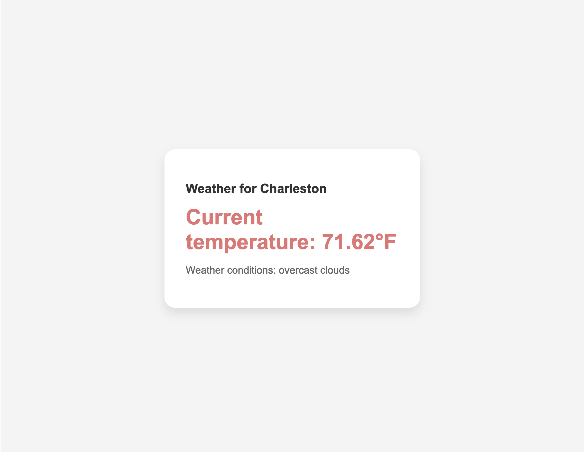

# Charleston Weather App

A real-time weather application built with Next.js that displays current weather conditions for Charleston, SC.

## Getting Started
### Prerequisites

- Node.js installed on your machine
- OpenWeather API key

### Installation

1. Clone the repository:
```bash
git clone https://github.com/jfelic/WeatherAppNextJS.git
cd WeatherAppNextJS
cd my-app
```
2. Install dependencies:
```bash
npm install
```
3. Create a .env.local file in the root directory and add your OpenWeather API key:
```bash
NEXT_PUBLIC_WEATHER_API_KEY=your_api_key_here
```
4. Run the development server:
```bash
npm run dev
```
5. Open http://localhost:3000 in your browser to see the app.

## Features

- Real-time weather data from OpenWeather API
- Current temperature in Fahrenheit
- Weather conditions description
- Location-specific weather for Charleston, SC coordinates

## Screenshots


## Technologies Used

- Next.js
- React
- OpenWeather API
- CSS Modules

